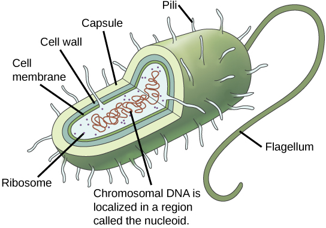

By the end of this section, you will be able to:
* Describe the structure of prokaryotic and eukaryotic genomes
* Distinguish between chromosomes, genes, and traits
* Describe the mechanisms of chromosome compaction

The continuity of life from one cell to another has its foundation in the reproduction of cells by way of the cell cycle. The **cell cycle**{: data-type="term"} is an orderly sequence of events that describes the stages of a cell’s life from the division of a single parent cell to the production of two new daughter cells. The mechanisms involved in the cell cycle are highly regulated.

# Genomic DNA

Before discussing the steps a cell must undertake to replicate, a deeper understanding of the structure and function of a cell’s genetic information is necessary. A cell’s DNA, packaged as a double-stranded DNA molecule, is called its **genome**{: data-type="term"}. In prokaryotes, the genome is composed of a single, double-stranded DNA molecule in the form of a loop or circle ([\[link\]](#fig-ch10_01_01)). The region in the cell containing this genetic material is called a nucleoid. Some prokaryotes also have smaller loops of DNA called plasmids that are not essential for normal growth. Bacteria can exchange these plasmids with other bacteria, sometimes receiving beneficial new genes that the recipient can add to their chromosomal DNA. Antibiotic resistance is one trait that often spreads through a bacterial colony through plasmid exchange.

{: #fig-ch10_01_01 data-media-type="image/jpg"}

In eukaryotes, the genome consists of several double-stranded linear DNA molecules ([\[link\]](#fig-ch10_01_02)). Each species of eukaryotes has a characteristic number of chromosomes in the nuclei of its cells. Human body cells have 46 chromosomes, while human **gametes**{: data-type="term"} (sperm or eggs) have 23 chromosomes each. A typical body cell, or somatic cell, contains two matched sets of chromosomes, a configuration known as **diploid**{: data-type="term"}. The letter *n* is used to represent a single set of chromosomes; therefore, a diploid organism is designated 2*n*. Human cells that contain one set of chromosomes are called gametes, or sex cells; these are eggs and sperm, and are designated *1n*, or **haploid**{: data-type="term"}.

![The 23 chromosomes from a human female are each dyed a different color so they can be distinguished. During most of the cell cycle, each chromosome is elongated into a thin strand that folds over on itself, like a piece of spaghetti.  The chromosomes fill the entire spherical nucleus, but each one is contained in a different part, resulting in a multi-colored sphere. During mitosis, the chromosomes condense into thick, compact bars, each a different color. These bars can be arranged in numerical order to form a karyotype. There are two copies of each chromosome in the karyotype..](../resources/Figure_10_01_02.jpg "There are 23 pairs of homologous chromosomes in a female human somatic cell. The condensed chromosomes are viewed within the nucleus (top), removed from a cell in mitosis and spread out on a slide (right), and artificially arranged according to length (left); an arrangement like this is called a karyotype. In this image, the chromosomes were exposed to fluorescent stains for differentiation of the different chromosomes. A method of staining called &#x201C;chromosome painting&#x201D; employs fluorescent dyes that highlight chromosomes in different colors. (credit: National Human Genome Project/NIH)"){: #fig-ch10_01_02 data-media-type="image/jpg"}

Matched pairs of chromosomes in a diploid organism are called **homologous**{: data-type="term"} (“same knowledge”) **chromosomes**{: data-type="term"}. Homologous chromosomes are the same length and have specific nucleotide segments called **genes**{: data-type="term"} in exactly the same location, or **locus**{: data-type="term"}. Genes, the functional units of chromosomes, determine specific characteristics by coding for specific proteins. Traits are the variations of those characteristics. For example, hair color is a characteristic with traits that are blonde, brown, or black.

Each copy of a homologous pair of chromosomes originates from a different parent; therefore, the genes themselves are not identical. The variation of individuals within a species is due to the specific combination of the genes inherited from both parents. Even a slightly altered sequence of nucleotides within a gene can result in an alternative trait. For example, there are three possible gene sequences on the human chromosome that code for blood type: sequence A, sequence B, and sequence O. Because all diploid human cells have two copies of the chromosome that determines blood type, the blood type (the trait) is determined by which two versions of the marker gene are inherited. It is possible to have two copies of the same gene sequence on both homologous chromosomes, with one on each (for example, AA, BB, or OO), or two different sequences, such as AB.

Minor variations of traits, such as blood type, eye color, and handedness, contribute to the natural variation found within a species. However, if the entire DNA sequence from any pair of human homologous chromosomes is compared, the difference is less than one percent. The sex chromosomes, X and Y, are the single exception to the rule of homologous chromosome uniformity: Other than a small amount of homology that is necessary to accurately produce gametes, the genes found on the X and Y chromosomes are different.

# Eukaryotic Chromosomal Structure and Compaction

If the DNA from all 46 chromosomes in a human cell nucleus was laid out end to end, it would measure approximately two meters; however, its diameter would be only 2 nm. Considering that the size of a typical human cell is about 10 µm (100,000 cells lined up to equal one meter), DNA must be tightly packaged to fit in the cell’s nucleus. At the same time, it must also be readily accessible for the genes to be expressed. During some stages of the cell cycle, the long strands of DNA are condensed into compact chromosomes. There are a number of ways that chromosomes are compacted.

In the first level of compaction, short stretches of the DNA double helix wrap around a core of eight **histone proteins**{: data-type="term"} at regular intervals along the entire length of the chromosome ([\[link\]](#fig-ch10_01_03)). The DNA-histone complex is called chromatin. The beadlike, histone DNA complex is called a **nucleosome**{: data-type="term"}, and DNA connecting the nucleosomes is called linker DNA. A DNA molecule in this form is about seven times shorter than the double helix without the histones, and the beads are about 10 nm in diameter, in contrast with the 2-nm diameter of a DNA double helix. The next level of compaction occurs as the nucleosomes and the linker DNA between them are coiled into a 30-nm chromatin fiber. This coiling further shortens the chromosome so that it is now about 50 times shorter than the extended form. In the third level of packing, a variety of fibrous proteins is used to pack the chromatin. These fibrous proteins also ensure that each chromosome in a non-dividing cell occupies a particular area of the nucleus that does not overlap with that of any other chromosome (see the top image in [\[link\]](#fig-ch10_01_02)).

 {: #fig-ch10_01_03 data-media-type="image/jpg"}

DNA replicates in the S phase of interphase. After replication, the chromosomes are composed of two linked sister **chromatids**{: data-type="term"}. When fully compact, the pairs of identically packed chromosomes are bound to each other by cohesin proteins. The connection between the sister chromatids is closest in a region called the **centromere**{: data-type="term"}. The conjoined sister chromatids, with a diameter of about 1 µm, are visible under a light microscope. The centromeric region is highly condensed and thus will appear as a constricted area.

Link to Learning

 {: data-media-type="image/png"} 
[This animation][1]{: target="_window"} illustrates the different levels of chromosome packing.

# Section Summary

Prokaryotes have a single circular chromosome composed of double-stranded DNA, whereas eukaryotes have multiple, linear chromosomes composed of chromatin surrounded by a nuclear membrane. The 46 chromosomes of human somatic cells are composed of 22 pairs of autosomes (matched pairs) and a pair of sex chromosomes, which may or may not be matched. This is the 2*n* or diploid state. Human gametes have 23 chromosomes or one complete set of chromosomes; a set of chromosomes is complete with either one of the sex chromosomes. This is the *n* or haploid state. Genes are segments of DNA that code for a specific protein. An organism’s traits are determined by the genes inherited from each parent. Duplicated chromosomes are composed of two sister chromatids. Chromosomes are compacted using a variety of mechanisms during certain stages of the cell cycle. Several classes of protein are involved in the organization and packing of the chromosomal DNA into a highly condensed structure. The condensing complex compacts chromosomes, and the resulting condensed structure is necessary for chromosomal segregation during mitosis.

# Review Questions

A diploid cell has\_\_\_\_\_\_\_ the number of chromosomes as a haploid cell.

1.  one-fourth
2.  half
3.  twice
4.  four times
{: data-number-style="lower-alpha"}

C

An organism’s traits are determined by the specific combination of inherited \_\_\_\_\_.

1.  cells.
2.  genes.
3.  proteins.
4.  chromatids.
{: data-number-style="lower-alpha"}

B

The first level of DNA organization in a eukaryotic cell is maintained by which molecule?

1.  cohesin
2.  condensin
3.  chromatin
4.  histone
{: data-number-style="lower-alpha"}

D

Identical copies of chromatin held together by cohesin at the centromere are called \_\_\_\_\_.

1.  histones.
2.  nucleosomes.
3.  chromatin.
4.  sister chromatids.
{: data-number-style="lower-alpha"}

D

# Free Response

Compare and contrast a human somatic cell to a human gamete.

Human somatic cells have 46 chromosomes: 22 pairs and 2 sex chromosomes that may or may not form a pair. This is the 2*n* or diploid condition. Human gametes have 23 chromosomes, one each of 23 unique chromosomes, one of which is a sex chromosome. This is the *n* or haploid condition.

What is the relationship between a genome, chromosomes, and genes?

The genome consists of the sum total of an organism’s chromosomes. Each chromosome contains hundreds and sometimes thousands of genes, segments of DNA that code for a polypeptide or RNA, and a large amount of DNA with no known function.

Eukaryotic chromosomes are thousands of times longer than a typical cell. Explain how chromosomes can fit inside a eukaryotic nucleus.

The DNA double helix is wrapped around histone proteins to form structures called nucleosomes. Nucleosomes and the linker DNA in between them are coiled into a 30-nm fiber. During cell division, chromatin is further condensed by packing proteins.

[1]: http://openstaxcollege.org/l/Packaged_DNA
