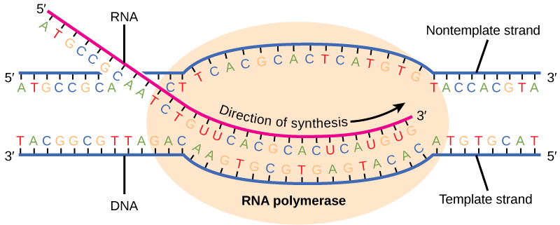

By the end of this section, you will be able to:
* List the different steps in prokaryotic transcription
* Discuss the role of promoters in prokaryotic transcription
* Describe how and when transcription is terminated

The prokaryotes, which include bacteria and archaea, are mostly single-celled organisms that, by definition, lack membrane-bound nuclei and other organelles. A bacterial chromosome is a covalently closed circle that, unlike eukaryotic chromosomes, is not organized around histone proteins. The central region of the cell in which prokaryotic DNA resides is called the nucleoid. In addition, prokaryotes often have abundant **plasmids**{: data-type="term"}, which are shorter circular DNA molecules that may only contain one or a few genes. Plasmids can be transferred independently of the bacterial chromosome during cell division and often carry traits such as antibiotic resistance.

Transcription in prokaryotes (and in eukaryotes) requires the DNA double helix to partially unwind in the region of mRNA synthesis. The region of unwinding is called a **transcription bubble.**{: data-type="term"} Transcription always proceeds from the same DNA strand for each gene, which is called the **template strand**{: data-type="term"}. The mRNA product is complementary to the template strand and is almost identical to the other DNA strand, called the **nontemplate strand**{: data-type="term"}. The only difference is that in mRNA, all of the T nucleotides are replaced with U nucleotides. In an RNA double helix, A can bind U via two hydrogen bonds, just as in A–T pairing in a DNA double helix.

The nucleotide pair in the DNA double helix that corresponds to the site from which the first 5\' mRNA nucleotide is transcribed is called the +1 site, or the **initiation site**{: data-type="term"}. Nucleotides preceding the initiation site are given negative numbers and are designated **upstream**{: data-type="term"}. Conversely, nucleotides following the initiation site are denoted with “+” numbering and are called **downstream**{: data-type="term"} nucleotides.

### Initiation of Transcription in Prokaryotes

Prokaryotes do not have membrane-enclosed nuclei. Therefore, the processes of transcription, translation, and mRNA degradation can all occur simultaneously. The intracellular level of a bacterial protein can quickly be amplified by multiple transcription and translation events occurring concurrently on the same DNA template. Prokaryotic transcription often covers more than one gene and produces polycistronic mRNAs that specify more than one protein.

Our discussion here will exemplify transcription by describing this process in *Escherichia coli*, a well-studied bacterial species. Although some differences exist between transcription in *E. coli* and transcription in archaea, an understanding of <em>E. coli </em>transcription can be applied to virtually all bacterial species.

#### Prokaryotic RNA Polymerase

Prokaryotes use the same RNA polymerase to transcribe all of their genes. In *E. coli*, the polymerase is composed of five polypeptide subunits, two of which are identical. Four of these subunits, denoted *α*, *α*, *β*, and *β*\' comprise the polymerase **core enzyme**{: data-type="term"}. These subunits assemble every time a gene is transcribed, and they disassemble once transcription is complete. Each subunit has a unique role; the two *α*-subunits are necessary to assemble the polymerase on the DNA; the *β*-subunit binds to the ribonucleoside triphosphate that will become part of the nascent “recently born” mRNA molecule; and the *β*\' binds the DNA template strand. The fifth subunit, *σ*, is involved only in transcription initiation. It confers transcriptional specificity such that the polymerase begins to synthesize mRNA from an appropriate initiation site. Without *σ*, the core enzyme would transcribe from random sites and would produce mRNA molecules that specified protein gibberish. The polymerase comprised of all five subunits is called the **holoenzyme**{: data-type="term"}.

#### Prokaryotic Promoters

A **promoter**{: data-type="term"} is a DNA sequence onto which the transcription machinery binds and initiates transcription. In most cases, promoters exist upstream of the genes they regulate. The specific sequence of a promoter is very important because it determines whether the corresponding gene is transcribed all the time, some of the time, or infrequently. Although promoters vary among prokaryotic genomes, a few elements are conserved. At the -10 and -35 regions upstream of the initiation site, there are two promoter **consensus**{: data-type="term"} sequences, or regions that are similar across all promoters and across various bacterial species ([\[link\]](#fig-ch15_02_01)). The -10 consensus sequence, called the -10 region, is TATAAT. The -35 sequence, TTGACA, is recognized and bound by *σ*. Once this interaction is made, the subunits of the core enzyme bind to the site. The A–T-rich -10 region facilitates unwinding of the DNA template, and several phosphodiester bonds are made. The transcription initiation phase ends with the production of abortive transcripts, which are polymers of approximately 10 nucleotides that are made and released.

{: #fig-ch15_02_01}

Link to Learning

View this [MolecularMovies animation][1]{: target="_window"} to see the first part of transcription and the base sequence repetition of the TATA box.

### Elongation and Termination in Prokaryotes

The transcription elongation phase begins with the release of the *σ* subunit from the polymerase. The dissociation of *σ* allows the core enzyme to proceed along the DNA template, synthesizing mRNA in the 5\' to 3\' direction at a rate of approximately 40 nucleotides per second. As elongation proceeds, the DNA is continuously unwound ahead of the core enzyme and rewound behind it ([\[link\]](#fig-ch15_02_02)). The base pairing between DNA and RNA is not stable enough to maintain the stability of the mRNA synthesis components. Instead, the RNA polymerase acts as a stable linker between the DNA template and the nascent RNA strands to ensure that elongation is not interrupted prematurely.

 {: #fig-ch15_02_02}

### Prokaryotic Termination Signals

Once a gene is transcribed, the prokaryotic polymerase needs to be instructed to dissociate from the DNA template and liberate the newly made mRNA. Depending on the gene being transcribed, there are two kinds of termination signals. One is protein-based and the other is RNA-based. **Rho-dependent termination**{: data-type="term"} is controlled by the rho protein, which tracks along behind the polymerase on the growing mRNA chain. Near the end of the gene, the polymerase encounters a run of G nucleotides on the DNA template and it stalls. As a result, the rho protein collides with the polymerase. The interaction with rho releases the mRNA from the transcription bubble.

**Rho-independent termination**{: data-type="term"} is controlled by specific sequences in the DNA template strand. As the polymerase nears the end of the gene being transcribed, it encounters a region rich in C–G nucleotides. The mRNA folds back on itself, and the complementary C–G nucleotides bind together. The result is a stable **hairpin**{: data-type="term"} that causes the polymerase to stall as soon as it begins to transcribe a region rich in A–T nucleotides. The complementary U–A region of the mRNA transcript forms only a weak interaction with the template DNA. This, coupled with the stalled polymerase, induces enough instability for the core enzyme to break away and liberate the new mRNA transcript.

Upon termination, the process of transcription is complete. By the time termination occurs, the prokaryotic transcript would already have been used to begin synthesis of numerous copies of the encoded protein because these processes can occur concurrently. The unification of transcription, translation, and even mRNA degradation is possible because all of these processes occur in the same 5\' to 3\' direction, and because there is no membranous compartmentalization in the prokaryotic cell ([\[link\]](#fig-ch15_02_03)). In contrast, the presence of a nucleus in eukaryotic cells precludes simultaneous transcription and translation.

 {: #fig-ch15_02_03}

Link to Learning

Visit this [ BioStudio animation][2]{: target="_window"} to see the process of prokaryotic transcription.

### Section Summary

In prokaryotes, mRNA synthesis is initiated at a promoter sequence on the DNA template comprising two consensus sequences that recruit RNA polymerase. The prokaryotic polymerase consists of a core enzyme of four protein subunits and a *σ* protein that assists only with initiation. Elongation synthesizes mRNA in the 5\' to 3\' direction at a rate of 40 nucleotides per second. Termination liberates the mRNA and occurs either by rho protein interaction or by the formation of an mRNA hairpin.

### Review Questions

Which subunit of the *E. coli* polymerase confers specificity to transcription?

1.  *α*
2.  *β*
3.  *β*'
4.  *σ*
{: data-number-style="lower-alpha"}

D

The -10 and -35 regions of prokaryotic promoters are called consensus sequences because \_\_\_\_\_\_\_\_.

1.  they are identical in all bacterial species
2.  they are similar in all bacterial species
3.  they exist in all organisms
4.  they have the same function in all organisms
{: data-number-style="lower-alpha"}

B

### Free Response

If mRNA is complementary to the DNA template strand and the DNA template strand is complementary to the DNA nontemplate strand, then why are base sequences of mRNA and the DNA nontemplate strand not identical? Could they ever be?

DNA is different from RNA in that T nucleotides in DNA are replaced with U nucleotides in RNA. Therefore, they could never be identical in base sequence.

In your own words, describe the difference between rho-dependent and rho-independent termination of transcription in prokaryotes.

Rho-dependent termination is controlled by the rho protein, which tracks along behind the polymerase on the growing mRNA chain. Near the end of the gene, the polymerase stalls at a run of G nucleotides on the DNA template. The rho protein collides with the polymerase and releases mRNA from the transcription bubble. Rho-independent termination is controlled by specific sequences in the DNA template strand. As the polymerase nears the end of the gene being transcribed, it encounters a region rich in C–G nucleotides. This creates an mRNA hairpin that causes the polymerase to stall right as it begins to transcribe a region rich in A–T nucleotides. Because A–U bonds are less thermostable, the core enzyme falls away.

### Glossary
{: data-type="glossary-title"}

consensus
: DNA sequence that is used by many species to perform the same or similar functions
^

core enzyme
: prokaryotic RNA polymerase consisting of *α*, *α*, *β*, and *β*\' but missing *σ*; this complex performs elongation
^

downstream
: nucleotides following the initiation site in the direction of mRNA transcription; in general, sequences that are toward the 3\' end relative to a site on the mRNA
^

hairpin
: structure of RNA when it folds back on itself and forms intramolecular hydrogen bonds between complementary nucleotides
^

holoenzyme
: prokaryotic RNA polymerase consisting of *α*, *α*, *β*, *β*\', and *σ*; this complex is responsible for transcription initiation
^

initiation site
: nucleotide from which mRNA synthesis proceeds in the 5\' to 3\' direction; denoted with a “+1”
^

nontemplate strand
: strand of DNA that is not used to transcribe mRNA; this strand is identical to the mRNA except that T nucleotides in the DNA are replaced by U nucleotides in the mRNA
^

plasmid
: extrachromosomal, covalently closed, circular DNA molecule that may only contain one or a few genes; common in prokaryotes
^

promoter
: DNA sequence to which RNA polymerase and associated factors bind and initiate transcription
^

Rho-dependent termination
: in prokaryotes, termination of transcription by an interaction between RNA polymerase and the rho protein at a run of G nucleotides on the DNA template
^

Rho-independent
: termination sequence-dependent termination of prokaryotic mRNA synthesis; caused by hairpin formation in the mRNA that stalls the polymerase
^

TATA box
: conserved promoter sequence in eukaryotes and prokaryotes that helps to establish the initiation site for transcription
^

template strand
: strand of DNA that specifies the complementary mRNA molecule
^

transcription bubble
: region of locally unwound DNA that allows for transcription of mRNA
^

upstream
: nucleotides preceding the initiation site; in general, sequences toward the 5\' end relative to a site on the mRNA

[1]: http://openstaxcollege.org/l/transcription
[2]: http://openstaxcollege.org/l/transcription2
